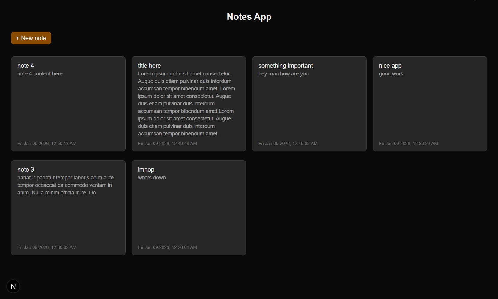

# Notes App

A simple full-stack CRUD app built with Next.js (frontend and backend) and MongoDB (database). It allows users to create, view, edit, and delete notes.

## Tech Stack

* **Frontend:** Next.js, Tailwind CSS, React Icons
* **Backend:** Next.js API Routes
* **Database:** MongoDB Atlas
* **ODM:** Mongoose

## Screenshot



## Setup Instructions

### 1. Clone the repository:

```bash
git clone <repository-url>
cd <repository-name>
```

### 2. Installation

Install the project dependencies:

```bash
npm install

```

### 3. Environment Variables

Create a `.env.local` file in the root directory and add your MongoDB connection string:

```text
MONGODB_URI=mongodb+srv://<username>:<password>@cluster.mongodb.net/NotesDB?retryWrites=true&w=majority

```

### 4. Run the Development Server

Start the application locally:

```bash
npm run dev

```

Open [http://localhost:3000](https://www.google.com/search?q=http://localhost:3000) in your browser to view the app.


## Project Structure

* `/app/api/notes/route.js`: Serverless API endpoints for CRUD operations.
* `/models/Note.js`: Mongoose schema defining the Note data structure.
* `/lib/dbConnect.js`: Utility to manage and cache the MongoDB connection.
* `/app/page.jsx`: Main frontend interface.
